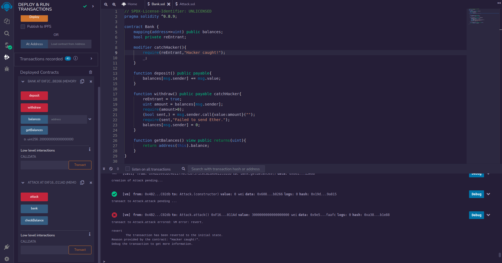

# Honeypot ( Catch The Hacker ) 

## Part-One

In this project, with the help of a mutex ( a state variable check ), we are catching the hacker. But mutex is visible in the Bank contract which makes it non re-Entrant.

When a proper example of setting a trap to catch the hacker is made, README will be updated. 
